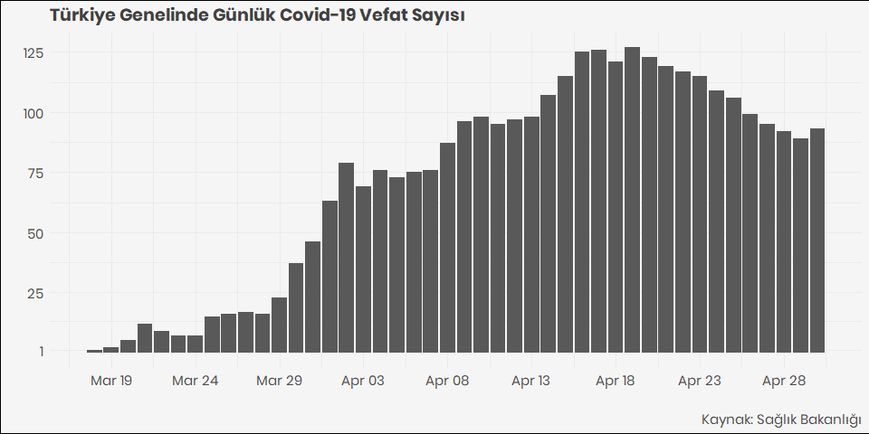
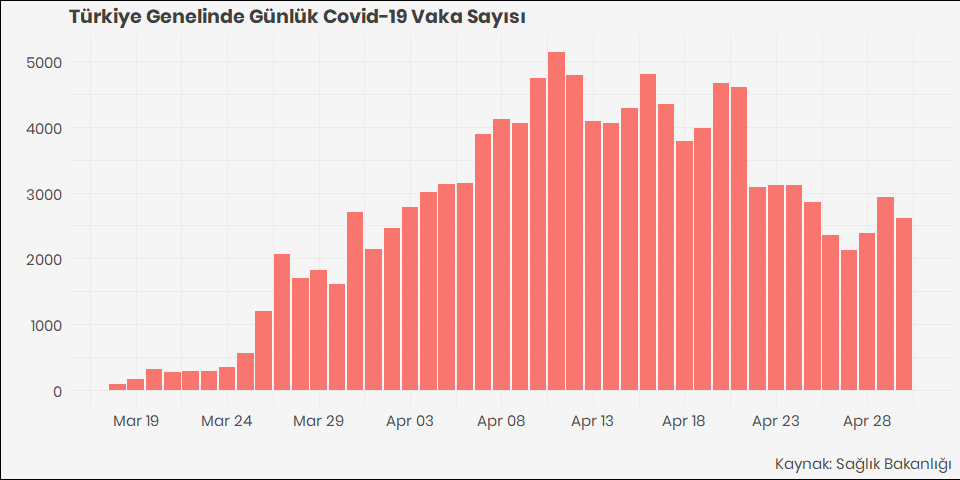

COVID-19 Türkiye Verileri | COVID-19 Turkey Data
================

  - Covid19 verisi Sağlık Bakanlığının [Covid19 takip
    sayfasından](https://covid19.saglik.gov.tr/) alınmıştır.
  - Verilere data klasöründen **CSV ve RDS** formatlarında
    ulaşabilirsiniz
  - Veriseti bünyesinde bulunduğum **[Veri Okuryazarlığı
    Derneği](https://twitter.com/voydorg)** tarafından derlenmiştir.
  - Ayrıca derlenen veri ile **[Koronavirüs Takip
    Sayfası](https://veribulteni.voyd.org.tr/koronavirus-takip/)**
    oluşturulmuştur
  - Verisetinde kümülatif ve günlük vaka, vefat ve iyileşme sayılarının
    dahil olduğu 13 değişken yer almaktadır.

<!-- end list -->

    ## [1] "Turkish_Turkey.1254"

#### 100 Vaka sonrası günlük vefat sayısı

<!-- -->

#### 100 Vaka sonrası günlük vaka sayısı

<!-- -->

#### Vaka, Vefat ve İyileşme (Case, Death and Recovery)

Aşağıdaki tablo verideki bazı değişkenleri ve son 20 günün verilerini
göstermektedir.

<table>

<thead>

<tr>

<th style="text-align:left;">

tarih

</th>

<th style="text-align:right;">

test

</th>

<th style="text-align:right;">

vaka

</th>

<th style="text-align:right;">

vefat

</th>

<th style="text-align:right;">

yogun\_bakim\_hasta

</th>

<th style="text-align:right;">

entube\_hasta

</th>

<th style="text-align:right;">

iyilesme

</th>

<th style="text-align:right;">

gunluk\_vefat

</th>

<th style="text-align:right;">

gunluk\_vaka

</th>

</tr>

</thead>

<tbody>

<tr>

<td style="text-align:left;">

28.04.2020

</td>

<td style="text-align:right;">

948115

</td>

<td style="text-align:right;">

114653

</td>

<td style="text-align:right;">

2992

</td>

<td style="text-align:right;">

1621

</td>

<td style="text-align:right;">

845

</td>

<td style="text-align:right;">

38809

</td>

<td style="text-align:right;">

92

</td>

<td style="text-align:right;">

2392

</td>

</tr>

<tr>

<td style="text-align:left;">

29.04.2020

</td>

<td style="text-align:right;">

991613

</td>

<td style="text-align:right;">

117589

</td>

<td style="text-align:right;">

3081

</td>

<td style="text-align:right;">

1574

</td>

<td style="text-align:right;">

831

</td>

<td style="text-align:right;">

44022

</td>

<td style="text-align:right;">

89

</td>

<td style="text-align:right;">

2936

</td>

</tr>

<tr>

<td style="text-align:left;">

30.04.2020

</td>

<td style="text-align:right;">

1033617

</td>

<td style="text-align:right;">

120204

</td>

<td style="text-align:right;">

3174

</td>

<td style="text-align:right;">

1514

</td>

<td style="text-align:right;">

803

</td>

<td style="text-align:right;">

48886

</td>

<td style="text-align:right;">

93

</td>

<td style="text-align:right;">

2615

</td>

</tr>

<tr>

<td style="text-align:left;">

01.05.2020

</td>

<td style="text-align:right;">

1075048

</td>

<td style="text-align:right;">

122392

</td>

<td style="text-align:right;">

3258

</td>

<td style="text-align:right;">

1480

</td>

<td style="text-align:right;">

818

</td>

<td style="text-align:right;">

53808

</td>

<td style="text-align:right;">

84

</td>

<td style="text-align:right;">

2188

</td>

</tr>

<tr>

<td style="text-align:left;">

02.05.2020

</td>

<td style="text-align:right;">

1111366

</td>

<td style="text-align:right;">

124375

</td>

<td style="text-align:right;">

3336

</td>

<td style="text-align:right;">

1445

</td>

<td style="text-align:right;">

778

</td>

<td style="text-align:right;">

58259

</td>

<td style="text-align:right;">

78

</td>

<td style="text-align:right;">

1983

</td>

</tr>

<tr>

<td style="text-align:left;">

03.05.2020

</td>

<td style="text-align:right;">

1135367

</td>

<td style="text-align:right;">

126045

</td>

<td style="text-align:right;">

3397

</td>

<td style="text-align:right;">

1424

</td>

<td style="text-align:right;">

766

</td>

<td style="text-align:right;">

63151

</td>

<td style="text-align:right;">

61

</td>

<td style="text-align:right;">

1670

</td>

</tr>

<tr>

<td style="text-align:left;">

04.05.2020

</td>

<td style="text-align:right;">

1171138

</td>

<td style="text-align:right;">

127659

</td>

<td style="text-align:right;">

3461

</td>

<td style="text-align:right;">

1384

</td>

<td style="text-align:right;">

727

</td>

<td style="text-align:right;">

68166

</td>

<td style="text-align:right;">

64

</td>

<td style="text-align:right;">

1614

</td>

</tr>

<tr>

<td style="text-align:left;">

05.05.2020

</td>

<td style="text-align:right;">

1204421

</td>

<td style="text-align:right;">

129491

</td>

<td style="text-align:right;">

3520

</td>

<td style="text-align:right;">

1338

</td>

<td style="text-align:right;">

707

</td>

<td style="text-align:right;">

73285

</td>

<td style="text-align:right;">

59

</td>

<td style="text-align:right;">

1832

</td>

</tr>

<tr>

<td style="text-align:left;">

06.05.2020

</td>

<td style="text-align:right;">

1234724

</td>

<td style="text-align:right;">

131744

</td>

<td style="text-align:right;">

3584

</td>

<td style="text-align:right;">

1278

</td>

<td style="text-align:right;">

669

</td>

<td style="text-align:right;">

78202

</td>

<td style="text-align:right;">

64

</td>

<td style="text-align:right;">

2253

</td>

</tr>

<tr>

<td style="text-align:left;">

07.05.2020

</td>

<td style="text-align:right;">

1265119

</td>

<td style="text-align:right;">

133721

</td>

<td style="text-align:right;">

3641

</td>

<td style="text-align:right;">

1260

</td>

<td style="text-align:right;">

665

</td>

<td style="text-align:right;">

82984

</td>

<td style="text-align:right;">

57

</td>

<td style="text-align:right;">

1977

</td>

</tr>

<tr>

<td style="text-align:left;">

08.05.2020

</td>

<td style="text-align:right;">

1298806

</td>

<td style="text-align:right;">

135569

</td>

<td style="text-align:right;">

3689

</td>

<td style="text-align:right;">

1219

</td>

<td style="text-align:right;">

653

</td>

<td style="text-align:right;">

86396

</td>

<td style="text-align:right;">

48

</td>

<td style="text-align:right;">

1848

</td>

</tr>

<tr>

<td style="text-align:left;">

09.05.2020

</td>

<td style="text-align:right;">

1334411

</td>

<td style="text-align:right;">

137115

</td>

<td style="text-align:right;">

3739

</td>

<td style="text-align:right;">

1168

</td>

<td style="text-align:right;">

628

</td>

<td style="text-align:right;">

89480

</td>

<td style="text-align:right;">

50

</td>

<td style="text-align:right;">

1546

</td>

</tr>

<tr>

<td style="text-align:left;">

10.05.2020

</td>

<td style="text-align:right;">

1370598

</td>

<td style="text-align:right;">

138657

</td>

<td style="text-align:right;">

3786

</td>

<td style="text-align:right;">

1154

</td>

<td style="text-align:right;">

598

</td>

<td style="text-align:right;">

92691

</td>

<td style="text-align:right;">

47

</td>

<td style="text-align:right;">

1542

</td>

</tr>

<tr>

<td style="text-align:left;">

11.05.2020

</td>

<td style="text-align:right;">

1403320

</td>

<td style="text-align:right;">

139771

</td>

<td style="text-align:right;">

3841

</td>

<td style="text-align:right;">

1126

</td>

<td style="text-align:right;">

578

</td>

<td style="text-align:right;">

95780

</td>

<td style="text-align:right;">

55

</td>

<td style="text-align:right;">

1114

</td>

</tr>

<tr>

<td style="text-align:left;">

12.05.2020

</td>

<td style="text-align:right;">

1440671

</td>

<td style="text-align:right;">

141475

</td>

<td style="text-align:right;">

3894

</td>

<td style="text-align:right;">

1045

</td>

<td style="text-align:right;">

576

</td>

<td style="text-align:right;">

98889

</td>

<td style="text-align:right;">

53

</td>

<td style="text-align:right;">

1704

</td>

</tr>

<tr>

<td style="text-align:left;">

13.05.2020

</td>

<td style="text-align:right;">

1474003

</td>

<td style="text-align:right;">

143114

</td>

<td style="text-align:right;">

3952

</td>

<td style="text-align:right;">

998

</td>

<td style="text-align:right;">

535

</td>

<td style="text-align:right;">

101715

</td>

<td style="text-align:right;">

58

</td>

<td style="text-align:right;">

1639

</td>

</tr>

<tr>

<td style="text-align:left;">

14.05.2020

</td>

<td style="text-align:right;">

1508824

</td>

<td style="text-align:right;">

144749

</td>

<td style="text-align:right;">

4007

</td>

<td style="text-align:right;">

963

</td>

<td style="text-align:right;">

508

</td>

<td style="text-align:right;">

104030

</td>

<td style="text-align:right;">

55

</td>

<td style="text-align:right;">

1635

</td>

</tr>

<tr>

<td style="text-align:left;">

15.05.2020

</td>

<td style="text-align:right;">

1547389

</td>

<td style="text-align:right;">

146457

</td>

<td style="text-align:right;">

4055

</td>

<td style="text-align:right;">

944

</td>

<td style="text-align:right;">

490

</td>

<td style="text-align:right;">

106133

</td>

<td style="text-align:right;">

48

</td>

<td style="text-align:right;">

1708

</td>

</tr>

<tr>

<td style="text-align:left;">

16.05.2020

</td>

<td style="text-align:right;">

1589625

</td>

<td style="text-align:right;">

148067

</td>

<td style="text-align:right;">

4096

</td>

<td style="text-align:right;">

906

</td>

<td style="text-align:right;">

474

</td>

<td style="text-align:right;">

108137

</td>

<td style="text-align:right;">

41

</td>

<td style="text-align:right;">

1610

</td>

</tr>

<tr>

<td style="text-align:left;">

17.05.2020

</td>

<td style="text-align:right;">

1624994

</td>

<td style="text-align:right;">

149435

</td>

<td style="text-align:right;">

4140

</td>

<td style="text-align:right;">

914

</td>

<td style="text-align:right;">

468

</td>

<td style="text-align:right;">

109962

</td>

<td style="text-align:right;">

44

</td>

<td style="text-align:right;">

1368

</td>

</tr>

</tbody>

</table>
