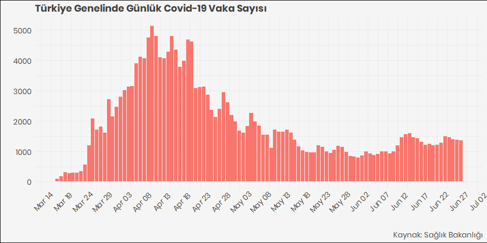

COVID-19 Türkiye Verileri | COVID-19 Turkey Data
================

**Veriseti Hakkında**

  - Covid19 verisi Sağlık Bakanlığının [Covid19 takip
    sayfasından](https://covid19.saglik.gov.tr/) alınmıştır.
  - Verilere data klasöründen **CSV ve RDS** formatlarında
    ulaşabilirsiniz
  - Veriseti bünyesinde bulunduğum **[Veri Okuryazarlığı
    Derneği](https://twitter.com/voydorg)** tarafından derlenmiştir.
  - Ayrıca derlenen veri ile **[Koronavirüs Takip
    Sayfası](https://veribulteni.voyd.org.tr/koronavirus-takip/)**
    oluşturulmuştur
  - Verisetinde kümülatif ve günlük vaka, vefat ve iyileşme sayılarının
    dahil olduğu 13 değişken yer almaktadır.

**About Dataset**

  - Covid-19 data is retrieved from Turkey’s Health Ministry [Covid-19
    update page](https://covid19.saglik.gov.tr/) daily (by hand)
  - Please find the datasets in English and Turkish from `Data` folder
  - Datasets contains cumulative and daily number of cases, deaths and
    recoveries along with icu patients.

<!-- end list -->

    ## [1] "Turkish_Turkey.1254"

#### Vaka, Vefat ve İyileşme

Aşağıdaki tablo verideki bazı değişkenleri ve son 5 günün verilerini
göstermektedir. Daha detaylı veriler için data klasörüne bakınız.

<table>

<thead>

<tr>

<th style="text-align:left;">

tarih

</th>

<th style="text-align:right;">

test

</th>

<th style="text-align:right;">

vaka

</th>

<th style="text-align:right;">

vefat

</th>

<th style="text-align:right;">

yogun\_bakim\_hasta

</th>

<th style="text-align:right;">

entube\_hasta

</th>

<th style="text-align:right;">

iyilesme

</th>

<th style="text-align:right;">

gunluk\_vefat

</th>

<th style="text-align:right;">

gunluk\_vaka

</th>

</tr>

</thead>

<tbody>

<tr>

<td style="text-align:left;">

17.06.2020

</td>

<td style="text-align:right;">

2773904

</td>

<td style="text-align:right;">

182727

</td>

<td style="text-align:right;">

4861

</td>

<td style="text-align:right;">

745

</td>

<td style="text-align:right;">

306

</td>

<td style="text-align:right;">

154640

</td>

<td style="text-align:right;">

19

</td>

<td style="text-align:right;">

1429

</td>

</tr>

<tr>

<td style="text-align:left;">

18.06.2020

</td>

<td style="text-align:right;">

2822316

</td>

<td style="text-align:right;">

184031

</td>

<td style="text-align:right;">

4882

</td>

<td style="text-align:right;">

755

</td>

<td style="text-align:right;">

311

</td>

<td style="text-align:right;">

156022

</td>

<td style="text-align:right;">

21

</td>

<td style="text-align:right;">

1304

</td>

</tr>

<tr>

<td style="text-align:left;">

19.06.2020

</td>

<td style="text-align:right;">

2863632

</td>

<td style="text-align:right;">

185245

</td>

<td style="text-align:right;">

4905

</td>

<td style="text-align:right;">

769

</td>

<td style="text-align:right;">

310

</td>

<td style="text-align:right;">

157516

</td>

<td style="text-align:right;">

23

</td>

<td style="text-align:right;">

1214

</td>

</tr>

<tr>

<td style="text-align:left;">

20.06.2020

</td>

<td style="text-align:right;">

2904744

</td>

<td style="text-align:right;">

186493

</td>

<td style="text-align:right;">

4927

</td>

<td style="text-align:right;">

781

</td>

<td style="text-align:right;">

318

</td>

<td style="text-align:right;">

158828

</td>

<td style="text-align:right;">

22

</td>

<td style="text-align:right;">

1248

</td>

</tr>

<tr>

<td style="text-align:left;">

21.06.2020

</td>

<td style="text-align:right;">

2945240

</td>

<td style="text-align:right;">

187685

</td>

<td style="text-align:right;">

4950

</td>

<td style="text-align:right;">

803

</td>

<td style="text-align:right;">

327

</td>

<td style="text-align:right;">

160240

</td>

<td style="text-align:right;">

23

</td>

<td style="text-align:right;">

1192

</td>

</tr>

</tbody>

</table>

#### Covid-19 cases, deaths and recoveries

Only the fraction of variables and last five days’ figures are shown
below. Please find the data folder and `rds` or `csv` data file for more
details.

<table>

<thead>

<tr>

<th style="text-align:left;">

date

</th>

<th style="text-align:right;">

tests

</th>

<th style="text-align:right;">

cases

</th>

<th style="text-align:right;">

deaths

</th>

<th style="text-align:right;">

ic\_patients

</th>

<th style="text-align:right;">

intubated\_patients

</th>

<th style="text-align:right;">

recovered

</th>

<th style="text-align:right;">

daily\_death

</th>

<th style="text-align:right;">

daily\_case

</th>

</tr>

</thead>

<tbody>

<tr>

<td style="text-align:left;">

17.06.2020

</td>

<td style="text-align:right;">

2773904

</td>

<td style="text-align:right;">

182727

</td>

<td style="text-align:right;">

4861

</td>

<td style="text-align:right;">

745

</td>

<td style="text-align:right;">

306

</td>

<td style="text-align:right;">

154640

</td>

<td style="text-align:right;">

19

</td>

<td style="text-align:right;">

1429

</td>

</tr>

<tr>

<td style="text-align:left;">

18.06.2020

</td>

<td style="text-align:right;">

2822316

</td>

<td style="text-align:right;">

184031

</td>

<td style="text-align:right;">

4882

</td>

<td style="text-align:right;">

755

</td>

<td style="text-align:right;">

311

</td>

<td style="text-align:right;">

156022

</td>

<td style="text-align:right;">

21

</td>

<td style="text-align:right;">

1304

</td>

</tr>

<tr>

<td style="text-align:left;">

19.06.2020

</td>

<td style="text-align:right;">

2863632

</td>

<td style="text-align:right;">

185245

</td>

<td style="text-align:right;">

4905

</td>

<td style="text-align:right;">

769

</td>

<td style="text-align:right;">

310

</td>

<td style="text-align:right;">

157516

</td>

<td style="text-align:right;">

23

</td>

<td style="text-align:right;">

1214

</td>

</tr>

<tr>

<td style="text-align:left;">

20.06.2020

</td>

<td style="text-align:right;">

2904744

</td>

<td style="text-align:right;">

186493

</td>

<td style="text-align:right;">

4927

</td>

<td style="text-align:right;">

781

</td>

<td style="text-align:right;">

318

</td>

<td style="text-align:right;">

158828

</td>

<td style="text-align:right;">

22

</td>

<td style="text-align:right;">

1248

</td>

</tr>

<tr>

<td style="text-align:left;">

21.06.2020

</td>

<td style="text-align:right;">

2945240

</td>

<td style="text-align:right;">

187685

</td>

<td style="text-align:right;">

4950

</td>

<td style="text-align:right;">

803

</td>

<td style="text-align:right;">

327

</td>

<td style="text-align:right;">

160240

</td>

<td style="text-align:right;">

23

</td>

<td style="text-align:right;">

1192

</td>

</tr>

</tbody>

</table>

**100 Vaka sonrası günlük vefat sayısı - Daily number of deaths after
100th case** <!-- -->

**100 Vaka sonrası günlük vaka sayısı - Daily number of cases after
100th case** <!-- -->
