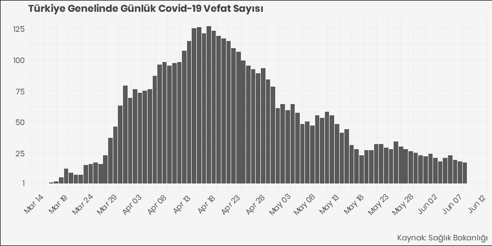

COVID-19 Türkiye Verileri | COVID-19 Turkey Data
================

  - Covid19 verisi Sağlık Bakanlığının [Covid19 takip
    sayfasından](https://covid19.saglik.gov.tr/) alınmıştır.
  - Verilere data klasöründen **CSV ve RDS** formatlarında
    ulaşabilirsiniz
  - Veriseti bünyesinde bulunduğum **[Veri Okuryazarlığı
    Derneği](https://twitter.com/voydorg)** tarafından derlenmiştir.
  - Ayrıca derlenen veri ile **[Koronavirüs Takip
    Sayfası](https://veribulteni.voyd.org.tr/koronavirus-takip/)**
    oluşturulmuştur
  - Verisetinde kümülatif ve günlük vaka, vefat ve iyileşme sayılarının
    dahil olduğu 13 değişken yer almaktadır.

<!-- end list -->

    ## [1] "Turkish_Turkey.1254"

#### 100 Vaka sonrası günlük vefat sayısı

<!-- -->

#### 100 Vaka sonrası günlük vaka sayısı

<!-- -->

#### Vaka, Vefat ve İyileşme (Case, Death and Recovery)

Aşağıdaki tablo verideki bazı değişkenleri ve son 20 günün verilerini
göstermektedir.

<table>

<thead>

<tr>

<th style="text-align:left;">

tarih

</th>

<th style="text-align:right;">

test

</th>

<th style="text-align:right;">

vaka

</th>

<th style="text-align:right;">

vefat

</th>

<th style="text-align:right;">

yogun\_bakim\_hasta

</th>

<th style="text-align:right;">

entube\_hasta

</th>

<th style="text-align:right;">

iyilesme

</th>

<th style="text-align:right;">

gunluk\_vefat

</th>

<th style="text-align:right;">

gunluk\_vaka

</th>

</tr>

</thead>

<tbody>

<tr>

<td style="text-align:left;">

11.04.2020

</td>

<td style="text-align:right;">

340380

</td>

<td style="text-align:right;">

52167

</td>

<td style="text-align:right;">

1101

</td>

<td style="text-align:right;">

1626

</td>

<td style="text-align:right;">

1021

</td>

<td style="text-align:right;">

2965

</td>

<td style="text-align:right;">

95

</td>

<td style="text-align:right;">

5138

</td>

</tr>

<tr>

<td style="text-align:left;">

12.04.2020

</td>

<td style="text-align:right;">

376100

</td>

<td style="text-align:right;">

56956

</td>

<td style="text-align:right;">

1198

</td>

<td style="text-align:right;">

1665

</td>

<td style="text-align:right;">

978

</td>

<td style="text-align:right;">

3446

</td>

<td style="text-align:right;">

97

</td>

<td style="text-align:right;">

4789

</td>

</tr>

<tr>

<td style="text-align:left;">

13.04.2020

</td>

<td style="text-align:right;">

410556

</td>

<td style="text-align:right;">

61049

</td>

<td style="text-align:right;">

1296

</td>

<td style="text-align:right;">

1786

</td>

<td style="text-align:right;">

1063

</td>

<td style="text-align:right;">

3957

</td>

<td style="text-align:right;">

98

</td>

<td style="text-align:right;">

4093

</td>

</tr>

<tr>

<td style="text-align:left;">

14.04.2020

</td>

<td style="text-align:right;">

443626

</td>

<td style="text-align:right;">

65111

</td>

<td style="text-align:right;">

1403

</td>

<td style="text-align:right;">

1809

</td>

<td style="text-align:right;">

1063

</td>

<td style="text-align:right;">

4799

</td>

<td style="text-align:right;">

107

</td>

<td style="text-align:right;">

4062

</td>

</tr>

<tr>

<td style="text-align:left;">

15.04.2020

</td>

<td style="text-align:right;">

477716

</td>

<td style="text-align:right;">

69392

</td>

<td style="text-align:right;">

1518

</td>

<td style="text-align:right;">

1820

</td>

<td style="text-align:right;">

1052

</td>

<td style="text-align:right;">

5674

</td>

<td style="text-align:right;">

115

</td>

<td style="text-align:right;">

4281

</td>

</tr>

<tr>

<td style="text-align:left;">

16.04.2020

</td>

<td style="text-align:right;">

518143

</td>

<td style="text-align:right;">

74193

</td>

<td style="text-align:right;">

1643

</td>

<td style="text-align:right;">

1854

</td>

<td style="text-align:right;">

1040

</td>

<td style="text-align:right;">

7089

</td>

<td style="text-align:right;">

125

</td>

<td style="text-align:right;">

4801

</td>

</tr>

<tr>

<td style="text-align:left;">

17.04.2020

</td>

<td style="text-align:right;">

558413

</td>

<td style="text-align:right;">

78546

</td>

<td style="text-align:right;">

1769

</td>

<td style="text-align:right;">

1845

</td>

<td style="text-align:right;">

1014

</td>

<td style="text-align:right;">

8631

</td>

<td style="text-align:right;">

126

</td>

<td style="text-align:right;">

4353

</td>

</tr>

<tr>

<td style="text-align:left;">

18.04.2020

</td>

<td style="text-align:right;">

598933

</td>

<td style="text-align:right;">

82329

</td>

<td style="text-align:right;">

1890

</td>

<td style="text-align:right;">

1894

</td>

<td style="text-align:right;">

1054

</td>

<td style="text-align:right;">

10453

</td>

<td style="text-align:right;">

121

</td>

<td style="text-align:right;">

3783

</td>

</tr>

<tr>

<td style="text-align:left;">

19.04.2020

</td>

<td style="text-align:right;">

634277

</td>

<td style="text-align:right;">

86306

</td>

<td style="text-align:right;">

2017

</td>

<td style="text-align:right;">

1922

</td>

<td style="text-align:right;">

1031

</td>

<td style="text-align:right;">

11976

</td>

<td style="text-align:right;">

127

</td>

<td style="text-align:right;">

3977

</td>

</tr>

<tr>

<td style="text-align:left;">

20.04.2020

</td>

<td style="text-align:right;">

673980

</td>

<td style="text-align:right;">

90980

</td>

<td style="text-align:right;">

2140

</td>

<td style="text-align:right;">

1909

</td>

<td style="text-align:right;">

1033

</td>

<td style="text-align:right;">

13430

</td>

<td style="text-align:right;">

123

</td>

<td style="text-align:right;">

4674

</td>

</tr>

<tr>

<td style="text-align:left;">

21.04.2020

</td>

<td style="text-align:right;">

713409

</td>

<td style="text-align:right;">

95591

</td>

<td style="text-align:right;">

2259

</td>

<td style="text-align:right;">

1865

</td>

<td style="text-align:right;">

1006

</td>

<td style="text-align:right;">

14918

</td>

<td style="text-align:right;">

119

</td>

<td style="text-align:right;">

4611

</td>

</tr>

<tr>

<td style="text-align:left;">

22.04.2020

</td>

<td style="text-align:right;">

750944

</td>

<td style="text-align:right;">

98674

</td>

<td style="text-align:right;">

2376

</td>

<td style="text-align:right;">

1814

</td>

<td style="text-align:right;">

985

</td>

<td style="text-align:right;">

16477

</td>

<td style="text-align:right;">

117

</td>

<td style="text-align:right;">

3083

</td>

</tr>

<tr>

<td style="text-align:left;">

23.04.2020

</td>

<td style="text-align:right;">

791906

</td>

<td style="text-align:right;">

101790

</td>

<td style="text-align:right;">

2491

</td>

<td style="text-align:right;">

1816

</td>

<td style="text-align:right;">

982

</td>

<td style="text-align:right;">

18491

</td>

<td style="text-align:right;">

115

</td>

<td style="text-align:right;">

3116

</td>

</tr>

<tr>

<td style="text-align:left;">

24.04.2020

</td>

<td style="text-align:right;">

830257

</td>

<td style="text-align:right;">

104912

</td>

<td style="text-align:right;">

2600

</td>

<td style="text-align:right;">

1790

</td>

<td style="text-align:right;">

929

</td>

<td style="text-align:right;">

21737

</td>

<td style="text-align:right;">

109

</td>

<td style="text-align:right;">

3122

</td>

</tr>

<tr>

<td style="text-align:left;">

25.04.2020

</td>

<td style="text-align:right;">

868565

</td>

<td style="text-align:right;">

107773

</td>

<td style="text-align:right;">

2706

</td>

<td style="text-align:right;">

1782

</td>

<td style="text-align:right;">

900

</td>

<td style="text-align:right;">

25582

</td>

<td style="text-align:right;">

106

</td>

<td style="text-align:right;">

2861

</td>

</tr>

<tr>

<td style="text-align:left;">

26.04.2020

</td>

<td style="text-align:right;">

889742

</td>

<td style="text-align:right;">

110130

</td>

<td style="text-align:right;">

2805

</td>

<td style="text-align:right;">

1776

</td>

<td style="text-align:right;">

883

</td>

<td style="text-align:right;">

29140

</td>

<td style="text-align:right;">

99

</td>

<td style="text-align:right;">

2357

</td>

</tr>

<tr>

<td style="text-align:left;">

27.04.2020

</td>

<td style="text-align:right;">

918885

</td>

<td style="text-align:right;">

112261

</td>

<td style="text-align:right;">

2900

</td>

<td style="text-align:right;">

1736

</td>

<td style="text-align:right;">

882

</td>

<td style="text-align:right;">

33791

</td>

<td style="text-align:right;">

95

</td>

<td style="text-align:right;">

2131

</td>

</tr>

<tr>

<td style="text-align:left;">

28.04.2020

</td>

<td style="text-align:right;">

948115

</td>

<td style="text-align:right;">

114653

</td>

<td style="text-align:right;">

2992

</td>

<td style="text-align:right;">

1621

</td>

<td style="text-align:right;">

845

</td>

<td style="text-align:right;">

38809

</td>

<td style="text-align:right;">

92

</td>

<td style="text-align:right;">

2392

</td>

</tr>

<tr>

<td style="text-align:left;">

29.04.2020

</td>

<td style="text-align:right;">

991613

</td>

<td style="text-align:right;">

117589

</td>

<td style="text-align:right;">

3081

</td>

<td style="text-align:right;">

1574

</td>

<td style="text-align:right;">

831

</td>

<td style="text-align:right;">

44022

</td>

<td style="text-align:right;">

89

</td>

<td style="text-align:right;">

2936

</td>

</tr>

<tr>

<td style="text-align:left;">

30.04.2020

</td>

<td style="text-align:right;">

1033617

</td>

<td style="text-align:right;">

120204

</td>

<td style="text-align:right;">

3174

</td>

<td style="text-align:right;">

1514

</td>

<td style="text-align:right;">

803

</td>

<td style="text-align:right;">

48886

</td>

<td style="text-align:right;">

93

</td>

<td style="text-align:right;">

2615

</td>

</tr>

</tbody>

</table>
